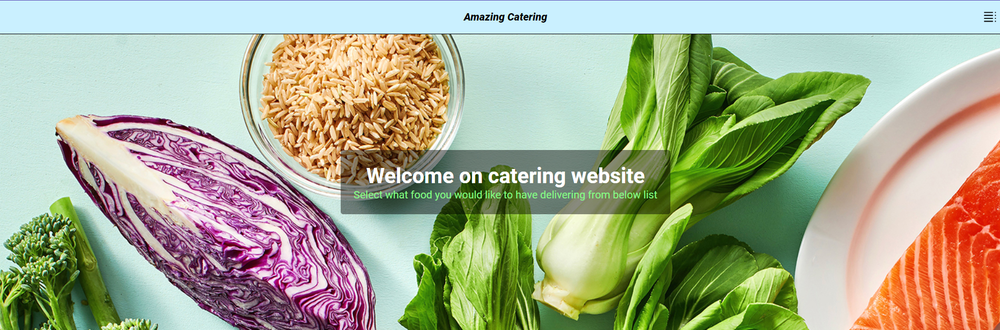
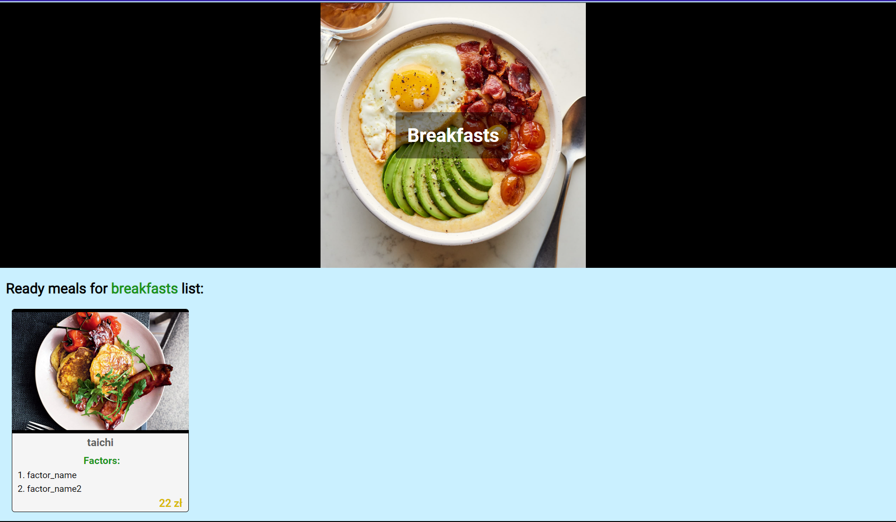
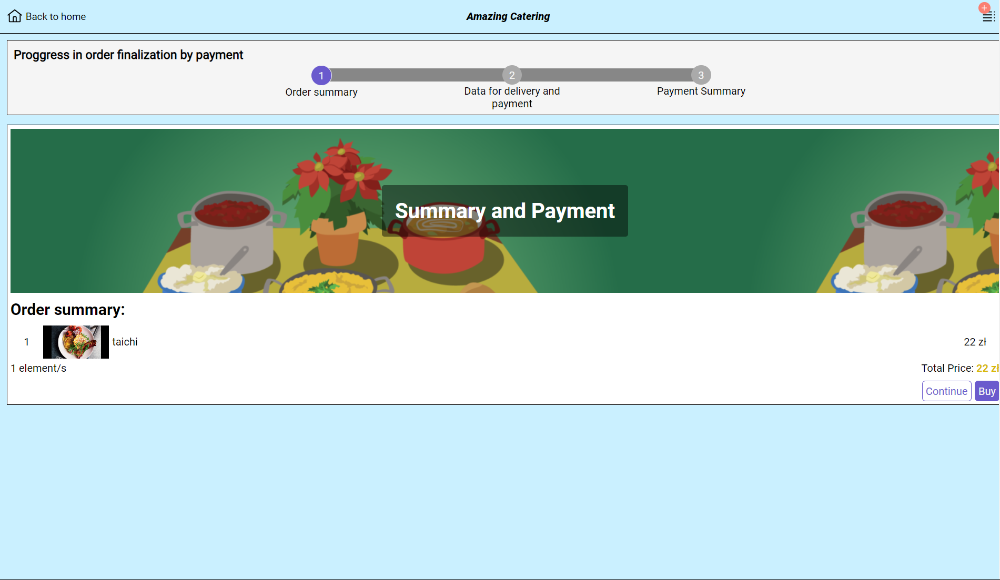
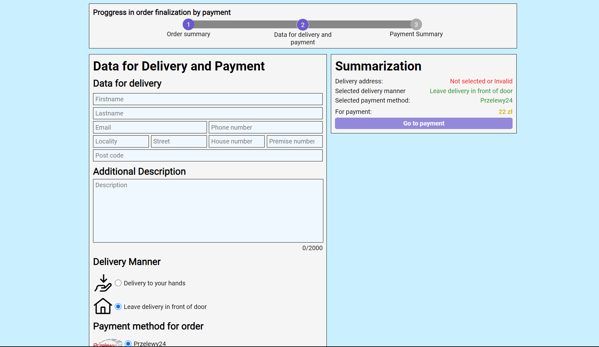
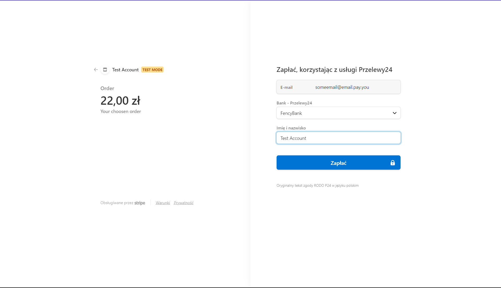
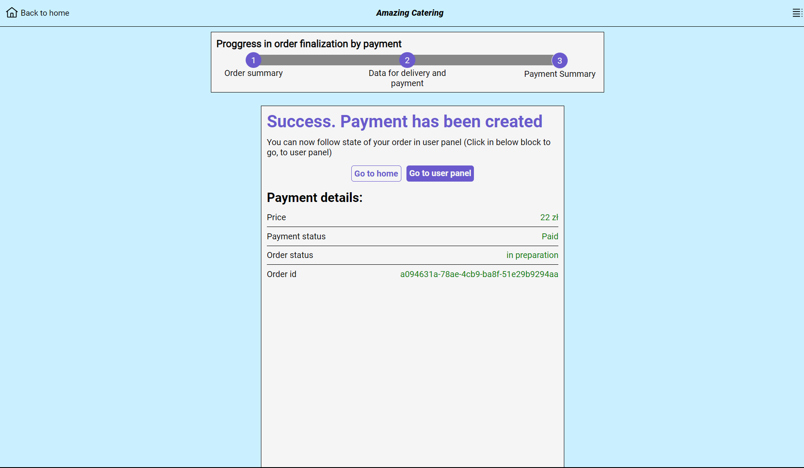

# Catering website preapred with Svelte + Kit

Example how catering website can look and behaves.
Payments integrations was made in Stripe (so far popular choise)

### Some previews:

1. Main page:

2. Meal for time page example: 

3. Payments page (1/3):

4. Payments page (2/3)

5. Payment throught Stripe page:

6. Success payment page (Payments page 3/3):
